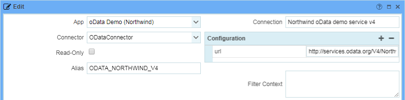
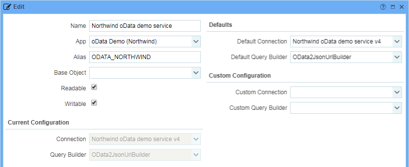
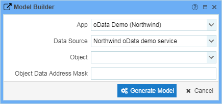

# Setting up an OData data source

Each OData service should be modeled as a sperate data source. The $metadata document can be imported and used to generate the corresponding metamodel automatically.

## Creating a data connection

Go to Administration > Metamodel > Connections and add a new connection as shown below.

The only mandatory configuration option is the `url`, which should point to the root of your OData service. Make sure, it ends with a slash (e.g. `http://services.odata.org/V4/Northwind/Northwind.svc/`). The connector does not depend on the version of the OData standard, that is being used.

The name and alias of your connection can be anything - refer to the general [data source documentation](https://github.com/exface/Core/blob/master/Docs/understanding_the_metamodel/data_sources_and_connections.md) for details.

If you have created an app for your OData metamodel, don't forget to assign it to the connection.

## Creating a data source

Now it's time to create a data source for our model. Proceed to Administration > Metamodel > Data Sources and add a new entry as shown below using the connection created in the previous step as default data connection.

## Generate the metamodel

Each OData service has a $metadata document, that describes it's entities, functions, etc. The $metadata is similar to the metamodel and can be easily used to generate objects, attributes and actions in it.

You can import the entire $metadata of your OData service by running the model builder on your data source. Go to Administration > Metamodel > Data Sources, select your OData source and start the model builder.

Just press "Generate Model" to import the entire $metadata. You can also a specific entity type name as data address mask to generate a model for this entity type only. Refer to the documentation of the ODataModelBuilder for more details (Administration > Documentation > Model Builders).

Running the model builder (again) on an existing model will import entity types, functions and actions, that are not present in the model yet. Existing meta objects will not get updated.

To update a specific meta object (e.g. to import new entity type properties), you will need to select it in the model builder explicitly or run the model builder for the meta object in Administration > Metamodel > Objects. However, the model builder will never import changes to existing attributes because it cannot know, if the metamodel was changed intentionally or the change originates from an update of the OData $metadata.

## Enhance the metamodel

The OData $metadata only provides general information about object (entity types), their attributes and relations and eventually actions. You will need to add more information to the metamodel to make it really usable: in particular, attributes need to be correctly marked filterable/sortable etc. to avoid runtime errors. Continue with the [OData metamodel documentation](the_metamodel_for_odata.md). 